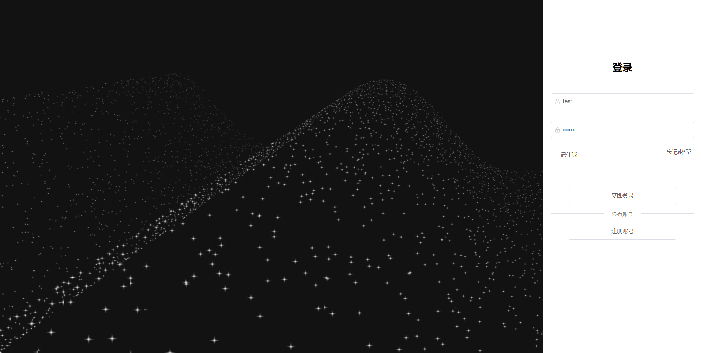
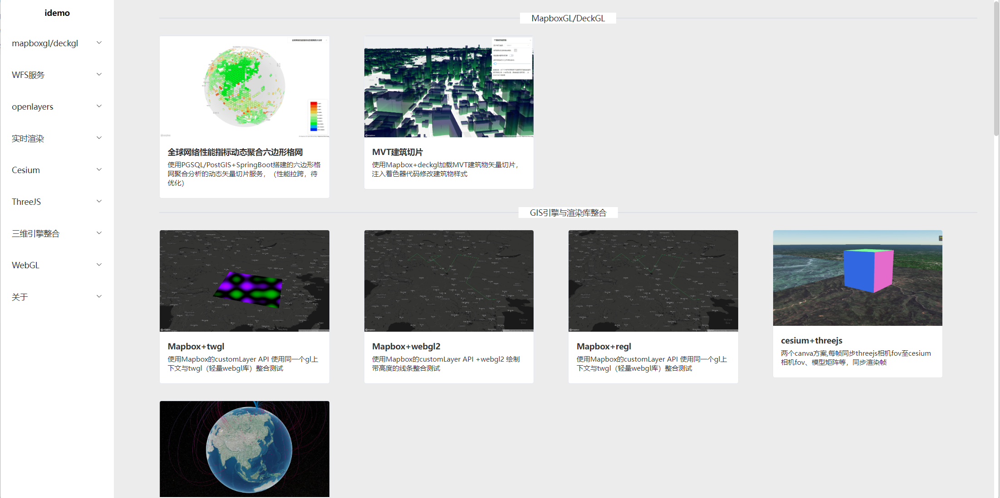
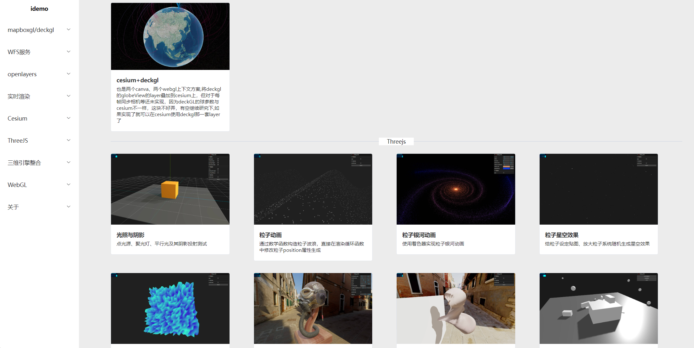
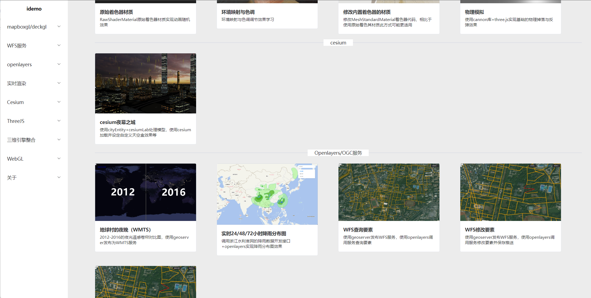
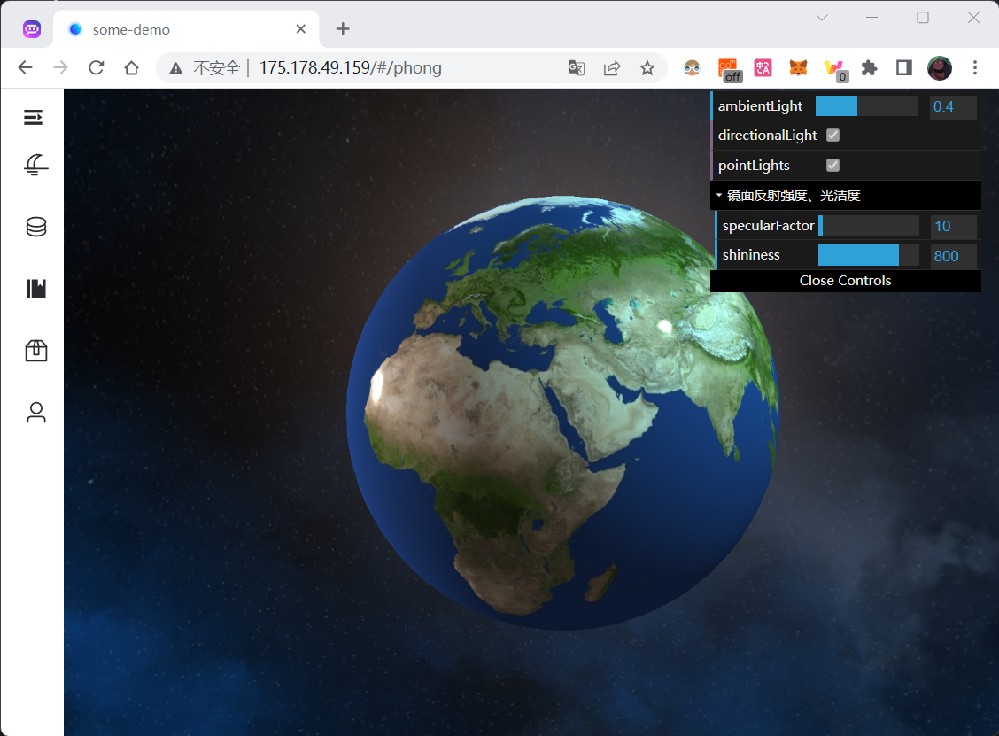

## 本地运行

已完成部分截图：










## phong着色模型



使用OGL（轻量级webgl库），渲染创建天空盒、球体并贴图低分辨率世界卫星影像地图，然后实现环境光和一个平行光的漫反射、镜面反射、一个点光源的漫反射、镜面反射

## 全球网络性能指标动态格网统计分析


采用pg的六边形格网生成函数动态聚合计算格网区域内的网络性能指标，最后使用动态矢量切片的方式将生成的格网数据以Mvt的形式返回给前端，动态矢量切片服务采用node.js搭建

前端则采用mapboxgl的将mvt数据中要素属性提取做表达式case(if)运算实现区相应的符号系统。

## 自定义建筑物样式

使用mapboxgl的customLayerAPI 接入deckGL的MvtLayer可实现大规模mvt瓦片数据的渲染与样式实时更新自定义，在或者编写shader注入实现一些更高级的效果


数据处理方式：在网上下载带高度值的矢量建筑物面数据，通常为shp格式的，如果投影不是web墨卡托还需要转为web墨卡托，然后转为geoJson格式的（直接在QGIS中导出数据选项中选择即可）

然后使用tippecanoe 进行矢量切片为MVT格式的xyz数据（我看DecKGL好像并不支持mbtiles数据）

```
tippecanoe --no-tile-compression -s EPSG:3857 -ad -an -Z10 -z16 -e gl-3857 -ai building_3857.geojson
```

在缩放级别 10-15 时，相对较小的建筑物被稀疏化，矢量切片500K 大小限制以下

- `-pC`:不要压缩 PBF 矢量切片数据
- `-ad`or`--drop-fraction-as-needed` :在每个缩放级别下动态删除部分要素，以将大图块保持在 500K 大小限制以下
- `-an`or`--drop-smallest-as-needed`:从每个缩放级别动态删除最小的要素(如最小的多边形)，以将大图块保持在 500K 大小限制以下
- `-e`:将 tiles 写入指定目录而不是 mbtiles 文件
- `-ai`:如果要素 ID 是数字的字符串表示形式，请将其转换为纯数字以用作要素 ID
- `-s`:指定投影，默认为3857


## 雨水分布图

数据：通过axios获取http://typhoon.zjwater.gov.cn/（浙江水利厅）中实时的降雨JSON数据,然后使用openlayers解析使用


## 地球村的夜晚

使用`openlayers`调用`geoserver`发布的`WMTS`服务并使用切片缓存的方式（由于云服务器配置低，所以在wimdow上切片，将切好的数据上传到云服务器的geoserver切片缓存目录下，然后直接调用）


卷帘的左侧为2012年的地球夜间灯光数据，右侧为2016年的地球夜间灯光数据，可以拖动拖动卷帘条拖动对比探索🌍🌎🌏，数据来源于NASA。

## 通过WFS查询要素

`shp`数据(下载于`OSM`路网数据）存储于`postgresql/postgis`，在`geoserver`连接`postgis`发布图层，供给openlayers调用（`openlayers`不支持`shpfile`，需通过`api`转成`geoJSON`）

查询要素（情况1：未加载）


查询要素（情况2：已加载）


## 通过WFS修改要素并保存到数据库


> 为了降低gif文件大小，将浏览器窗口减小和减低了FPS，将就看看≡[。。]≡

## 通过WFS添加要素


由于数据源的原因，无法真正的保存到数据库（偷懒一下，懒得折腾了ψ(._. )>)

## 通过WFS删除要素


